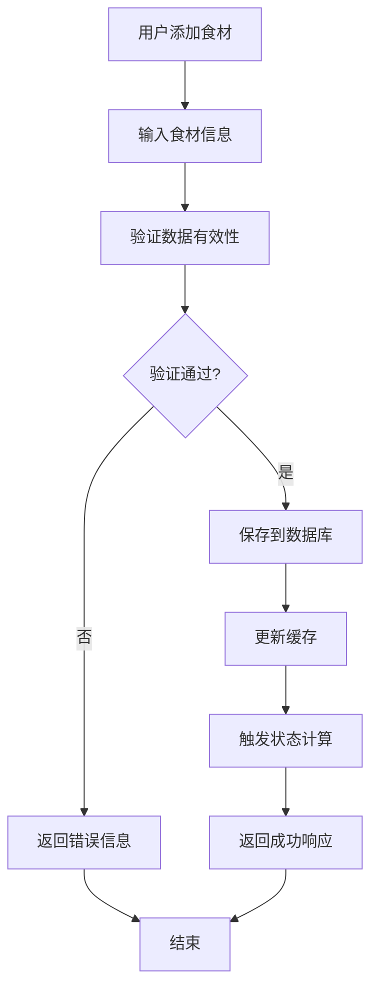
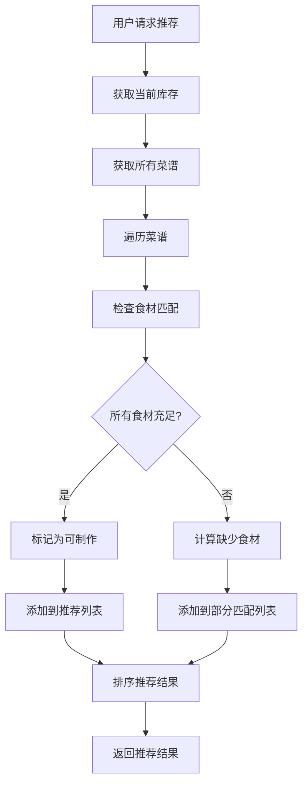
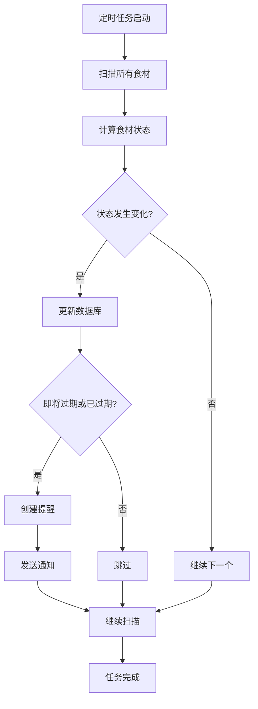

# 🧾 软件需求规格说明书（SRS）
## 项目名称：冰箱食物管理系统（FridgeMate）

---

## 目录
1. [引言](#1-引言)
2. [系统概述](#2-系统概述)
3. [功能需求](#3-功能需求)
4. [非功能性需求](#4-非功能性需求)
5. [技术架构](#5-技术架构)
6. [数据模型](#6-数据模型)
7. [系统流程](#7-系统流程)
8. [项目约束](#8-项目约束)
9. [未来功能](#9-未来功能)
10. [附录](#10-附录)

---

## 1. 引言

### 1.1 目的
本系统旨在帮助用户有效管理冰箱中的食材库存，追踪食材保质期，并根据即将过期的食材推荐可做的菜谱，减少浪费，提升家庭饮食效率。

**核心价值：**
- 🥬 减少食材浪费，节约家庭开支
- 📅 智能提醒，避免过期食材
- 🍳 菜谱推荐，提升烹饪效率
- 📊 库存可视化，便于管理

### 1.2 预期读者
本文档适用于以下角色：

| 角色 | 职责 | 文档关注点 |
|------|------|------------|
| **项目开发者** | C# / Java 开发 | 技术架构、数据模型、API设计 |
| **测试人员** | 功能测试、性能测试 | 功能需求、非功能性需求 |
| **产品设计人员** | UI/UX设计 | 用户交互流程、界面需求 |
| **学习者** | 学习项目开发 | 完整项目文档、最佳实践 |
| **项目报告审阅人** | 文档审查 | 需求完整性、技术可行性 |

### 1.3 定义与缩略词

| 缩略词 | 说明 |
|--------|------|
| **BOM** | Bill of Materials，菜谱所需食材组成清单 |
| **Redis** | 内存缓存系统，用于提升系统读取效率 |
| **PostgreSQL** | 开源关系型数据库 |
| **SRS** | 软件需求规格说明书（Software Requirements Specification） |
| **ORM** | Object-Relational Mapping，对象关系映射 |
| **API** | Application Programming Interface，应用程序编程接口 |
| **UUID** | Universally Unique Identifier，通用唯一标识符 |

---

## 2. 系统概述

### 2.1 系统目标
冰箱食物管理系统是一个智能化的家庭食材管理平台，通过数字化手段解决传统冰箱管理的痛点：

**解决的问题：**
- ❌ 食材过期浪费
- ❌ 重复购买食材
- ❌ 不知道做什么菜
- ❌ 库存管理混乱

**提供的解决方案：**
- ✅ 智能过期提醒
- ✅ 库存实时监控
- ✅ 菜谱智能推荐
- ✅ 采购清单生成

### 2.2 系统架构概览

```
┌─────────────────┐    ┌─────────────────┐    ┌─────────────────┐
│   用户界面层    │    │   业务逻辑层    │    │   数据访问层    │
│  (Web/Mobile)   │◄──►│  (Service Layer) │◄──►│  (Repository)   │
└─────────────────┘    └─────────────────┘    └─────────────────┘
         │                       │                       │
         ▼                       ▼                       ▼
┌─────────────────┐    ┌─────────────────┐    ┌─────────────────┐
│   缓存层        │    │   定时任务层    │    │   数据库层      │
│  (Redis)        │    │  (Background)   │    │  (PostgreSQL)   │
└─────────────────┘    └─────────────────┘    └─────────────────┘
```

### 2.3 核心功能模块

| 模块 | 功能描述 | 优先级 |
|------|----------|--------|
| **食材管理** | 入库、更新、出库、过期提醒 | 高 |
| **菜谱管理** | 录入菜谱及其所需食材（BOM） | 高 |
| **智能提醒** | 提醒即将过期的食材 | 高 |
| **菜谱推荐** | 基于现有食材智能推荐可做的菜谱 | 中 |
| **缓存优化** | 使用 Redis 提高读取频繁数据的响应效率 | 中 |

---

## 3. 功能需求

### 3.1 食材管理模块

#### 3.1.1 添加食材
**功能描述：** 用户可录入食材的基本信息到系统中

**输入参数：**
- 食材名称（必填，字符串，最大长度50字符）
- 数量（必填，浮点数，大于0）
- 单位（必填，枚举：个、克、千克、包、瓶等）
- 入库时间（必填，日期时间）
- 过期时间（必填，日期时间）
- 备注（可选，字符串，最大长度200字符）

**业务规则：**
- 过期时间必须晚于入库时间
- 食材名称不能为空
- 数量必须大于0

**输出结果：**
- 成功：返回食材ID和创建时间
- 失败：返回具体错误信息

#### 3.1.2 编辑/删除食材
**功能描述：** 支持修改食材信息或从系统中移除

**编辑功能：**
- 可修改除ID外的所有字段
- 修改后自动重新计算状态
- 保留修改历史记录

**删除功能：**
- 软删除：标记为已删除，不物理删除数据
- 硬删除：物理删除数据（需确认）

#### 3.1.3 状态标记
**功能描述：** 系统自动根据当前时间和过期时间对食材进行状态分类

**状态定义：**
```csharp
public enum FoodStatus
{
    Normal,           // 正常（距离过期 > 48小时）
    NearlyExpired,    // 即将过期（距离过期 ≤ 48小时）
    Expired          // 已过期（已超过过期时间）
}
```

**状态计算逻辑：**
```csharp
public FoodStatus CalculateStatus(DateTime expiryDate)
{
    var now = DateTime.Now;
    var timeUntilExpiry = expiryDate - now;
    
    if (timeUntilExpiry.TotalHours <= 0)
        return FoodStatus.Expired;
    else if (timeUntilExpiry.TotalHours <= 48)
        return FoodStatus.NearlyExpired;
    else
        return FoodStatus.Normal;
}
```

#### 3.1.4 查询功能
**功能描述：** 支持多维度查询食材信息

**查询条件：**
- 按名称模糊查询
- 按状态精确查询
- 按过期时间范围查询
- 按入库时间范围查询
- 组合查询（多条件）

**查询结果：**
- 分页显示（默认每页20条）
- 支持排序（按名称、入库时间、过期时间）
- 返回总数和当前页数据

### 3.2 菜谱管理模块

#### 3.2.1 添加菜谱
**功能描述：** 录入菜谱的基本信息和烹饪步骤

**输入参数：**
- 菜谱名称（必填，字符串，最大长度100字符）
- 描述（可选，字符串，最大长度500字符）
- 烹饪步骤（必填，文本）
- 所需食材列表（必填，至少一个食材）

**菜谱食材关联（BOM）：**
```csharp
public class RecipeIngredient
{
    public Guid RecipeId { get; set; }
    public Guid IngredientId { get; set; }
    public float Quantity { get; set; }
    public string Unit { get; set; }
}
```

#### 3.2.2 编辑/删除菜谱
**功能描述：** 对已存在菜谱进行修改或删除

**编辑功能：**
- 可修改菜谱基本信息
- 可修改食材清单
- 保留修改历史

**删除功能：**
- 删除菜谱时同时删除关联的食材关系
- 支持批量删除

#### 3.2.3 菜谱与食材关联（BOM）
**功能描述：** 每道菜谱可包含多个食材及其用量

**关联规则：**
- 一个菜谱可包含多个食材
- 一个食材可被多个菜谱使用
- 食材用量必须大于0
- 支持不同单位换算

### 3.3 智能提醒模块

#### 3.3.1 定时扫描
**功能描述：** 系统定时扫描所有食材，更新状态并生成提醒

**扫描频率：** 每小时执行一次

**扫描逻辑：**
```csharp
public async Task ScanExpiringFoods()
{
    var foods = await _foodRepository.GetAllAsync();
    var now = DateTime.Now;
    
    foreach (var food in foods)
    {
        var newStatus = CalculateStatus(food.ExpiryDate);
        if (food.Status != newStatus)
        {
            food.Status = newStatus;
            await _foodRepository.UpdateAsync(food);
            
            if (newStatus == FoodStatus.NearlyExpired || newStatus == FoodStatus.Expired)
            {
                await _notificationService.AddReminder(food);
            }
        }
    }
}
```

#### 3.3.2 提醒列表
**功能描述：** 提供今日待处理清单

**提醒内容：**
- 即将过期的食材（48小时内）
- 已过期的食材
- 库存不足的常用食材

**提醒方式：**
- 系统内消息提醒
- 邮件通知（可选）
- 推送通知（可选）

### 3.4 菜谱推荐模块

#### 3.4.1 推荐算法
**功能描述：** 系统根据当前库存，特别是即将过期的食材，推荐可做菜谱

**推荐逻辑：**
```csharp
public async Task<List<RecipeRecommendation>> GetRecommendedRecipes()
{
    var availableFoods = await _foodRepository.GetAvailableFoods();
    var recipes = await _recipeRepository.GetAllWithIngredients();
    var recommendations = new List<RecipeRecommendation>();
    
    foreach (var recipe in recipes)
    {
        var canMake = true;
        var missingIngredients = new List<string>();
        var expiringIngredients = new List<string>();
        
        foreach (var ingredient in recipe.Ingredients)
        {
            var availableFood = availableFoods.FirstOrDefault(f => 
                f.Name == ingredient.IngredientName);
                
            if (availableFood == null || availableFood.Quantity < ingredient.Quantity)
            {
                canMake = false;
                missingIngredients.Add(ingredient.IngredientName);
            }
            else if (availableFood.Status == FoodStatus.NearlyExpired)
            {
                expiringIngredients.Add(ingredient.IngredientName);
            }
        }
        
        if (canMake)
        {
            recommendations.Add(new RecipeRecommendation
            {
                Recipe = recipe,
                CanMakeImmediately = true,
                ExpiringIngredients = expiringIngredients,
                Priority = expiringIngredients.Count > 0 ? "High" : "Normal"
            });
        }
    }
    
    return recommendations.OrderByDescending(r => r.Priority).ToList();
}
```

#### 3.4.2 推荐结果
**功能描述：** 返回可制作的菜谱列表

**推荐分类：**
- **可立即制作**：所有必需食材库存充足
- **部分食材不足**：缺少部分食材，显示采购建议
- **优先推荐**：包含即将过期食材的菜谱

---

## 4. 非功能性需求

### 4.1 性能需求

#### 4.1.1 响应时间
- **页面加载时间**：≤ 2秒
- **API响应时间**：≤ 500毫秒
- **数据库查询时间**：≤ 100毫秒

#### 4.1.2 并发处理
- **并发用户数**：支持10个并发用户
- **数据库连接池**：最大20个连接
- **Redis连接池**：最大10个连接

#### 4.1.3 缓存策略
**Redis缓存配置：**
```json
{
  "Redis": {
    "ConnectionString": "localhost:6379",
    "Database": 0,
    "KeyPrefix": "fridgemate:",
    "DefaultExpiration": "00:30:00"
  }
}
```

**缓存内容：**
- 推荐菜谱列表（30分钟）
- 即将过期食材列表（15分钟）
- 常用菜谱（1小时）

### 4.2 可扩展性

#### 4.2.1 架构扩展
- **微服务化**：可拆分为食材服务、菜谱服务、推荐服务
- **容器化部署**：支持Docker容器化
- **云原生**：支持Kubernetes部署

#### 4.2.2 功能扩展
- **移动端应用**：React Native或Flutter
- **OCR识别**：集成图像识别API
- **AI推荐**：机器学习算法优化推荐

### 4.3 可维护性

#### 4.3.1 代码规范
- **命名规范**：遵循PascalCase和camelCase
- **注释要求**：所有公共方法必须有XML文档注释
- **单元测试**：核心业务逻辑测试覆盖率≥80%

#### 4.3.2 模块化设计
```csharp
// 项目结构
FridgeMate/
├── FridgeMate.API/           // Web API层
├── FridgeMate.Core/          // 业务逻辑层
├── FridgeMate.Infrastructure/ // 数据访问层
├── FridgeMate.Domain/        // 领域模型层
└── FridgeMate.Tests/         // 测试项目
```

### 4.4 安全性

#### 4.4.1 数据安全
- **数据加密**：敏感数据使用AES加密
- **SQL注入防护**：使用参数化查询
- **XSS防护**：输入验证和输出编码

#### 4.4.2 访问控制
- **身份验证**：JWT Token认证
- **权限控制**：基于角色的访问控制（RBAC）
- **审计日志**：记录所有重要操作

---

## 5. 技术架构

### 5.1 技术栈选择

| 层级 | 技术选择 | 版本 | 说明 |
|------|----------|------|------|
| **语言** | C# (.NET Core) / Java (Spring Boot) | .NET 8.0 / Java 17 | 跨平台开发 |
| **数据库** | PostgreSQL | 15+ | 开源关系型数据库 |
| **缓存** | Redis | 7.0+ | 内存缓存系统 |
| **ORM** | Entity Framework Core / JPA | EF Core 8.0 | 对象关系映射 |
| **API** | RESTful API | - | 标准Web API |
| **前端** | Vue.js / React / Flutter | Vue 3 / React 18 | 可选前端框架 |

### 5.2 系统架构图

```
┌─────────────────────────────────────────────────────────────┐
│                       客户端层                              │
│  ┌─────────────┐  ┌─────────────┐  ┌─────────────┐      │
│  │   Web界面   │  │  移动应用   │  │  桌面应用   │      │
│  └─────────────┘  └─────────────┘  └─────────────┘      │
└─────────────────────────────────────────────────────────────┘
                              │
                              ▼
┌─────────────────────────────────────────────────────────────┐
│                       API网关层                            │
│  ┌─────────────┐  ┌─────────────┐  ┌─────────────┐      │
│  │  认证授权   │  │  请求路由   │  │  限流控制   │      │
│  └─────────────┘  └─────────────┘  └─────────────┘      │
└─────────────────────────────────────────────────────────────┘
                              │
                              ▼
┌─────────────────────────────────────────────────────────────┐
│                      业务服务层                            │
│  ┌─────────────┐  ┌─────────────┐  ┌─────────────┐      │
│  │ 食材管理    │  │ 菜谱管理    │  │ 推荐服务    │      │
│  └─────────────┘  └─────────────┘  └─────────────┘      │
│  ┌─────────────┐  ┌─────────────┐  ┌─────────────┐      │
│  │ 提醒服务    │  │ 定时任务    │  │ 通知服务    │      │
│  └─────────────┘  └─────────────┘  └─────────────┘      │
└─────────────────────────────────────────────────────────────┘
                              │
                              ▼
┌─────────────────────────────────────────────────────────────┐
│                      数据访问层                            │
│  ┌─────────────┐  ┌─────────────┐  ┌─────────────┐      │
│  │  Repository │  │   Unit of   │  │   Query     │      │
│  │   Pattern   │  │   Work      │  │   Objects   │      │
│  └─────────────┘  └─────────────┘  └─────────────┘      │
└─────────────────────────────────────────────────────────────┘
                              │
                              ▼
┌─────────────────────────────────────────────────────────────┐
│                      数据存储层                            │
│  ┌─────────────┐  ┌─────────────┐  ┌─────────────┐      │
│  │PostgreSQL   │  │   Redis     │  │  文件存储   │      │
│  │  (主数据库) │  │  (缓存)     │  │  (图片)     │      │
│  └─────────────┘  └─────────────┘  └─────────────┘      │
└─────────────────────────────────────────────────────────────┘
```

### 5.3 部署架构

#### 5.3.1 开发环境
```yaml
# docker-compose.yml
version: '3.8'
services:
  api:
    build: .
    ports:
      - "5000:5000"
    depends_on:
      - postgres
      - redis
    environment:
      - ConnectionStrings__DefaultConnection=Host=postgres;Database=fridgemate;Username=postgres;Password=password
      - Redis__ConnectionString=redis:6379
  
  postgres:
    image: postgres:15
    environment:
      POSTGRES_DB: fridgemate
      POSTGRES_USER: postgres
      POSTGRES_PASSWORD: password
    ports:
      - "5432:5432"
    volumes:
      - postgres_data:/var/lib/postgresql/data
  
  redis:
    image: redis:7-alpine
    ports:
      - "6379:6379"
    volumes:
      - redis_data:/data

volumes:
  postgres_data:
  redis_data:
```

#### 5.3.2 生产环境
- **负载均衡**：Nginx反向代理
- **容器编排**：Kubernetes
- **监控**：Prometheus + Grafana
- **日志**：ELK Stack

---

## 6. 数据模型

### 6.1 核心实体

#### 6.1.1 食材表（FoodItem）
```csharp
public class FoodItem
{
    public Guid Id { get; set; }
    public string Name { get; set; } = string.Empty;
    public float Quantity { get; set; }
    public string Unit { get; set; } = string.Empty;
    public DateTime AddedDate { get; set; }
    public DateTime ExpiryDate { get; set; }
    public FoodStatus Status { get; set; }
    public string? Notes { get; set; }
    public DateTime CreatedAt { get; set; }
    public DateTime? UpdatedAt { get; set; }
    public bool IsDeleted { get; set; }
}
```

**数据库表结构：**
```sql
CREATE TABLE food_items (
    id UUID PRIMARY KEY DEFAULT gen_random_uuid(),
    name VARCHAR(50) NOT NULL,
    quantity DECIMAL(10,2) NOT NULL CHECK (quantity > 0),
    unit VARCHAR(20) NOT NULL,
    added_date TIMESTAMP NOT NULL,
    expiry_date TIMESTAMP NOT NULL,
    status VARCHAR(20) NOT NULL DEFAULT 'Normal',
    notes TEXT,
    created_at TIMESTAMP NOT NULL DEFAULT CURRENT_TIMESTAMP,
    updated_at TIMESTAMP,
    is_deleted BOOLEAN NOT NULL DEFAULT FALSE,
    
    CONSTRAINT chk_expiry_date CHECK (expiry_date > added_date)
);

CREATE INDEX idx_food_items_status ON food_items(status);
CREATE INDEX idx_food_items_expiry ON food_items(expiry_date);
CREATE INDEX idx_food_items_name ON food_items(name);
```

#### 6.1.2 菜谱表（Recipe）
```csharp
public class Recipe
{
    public Guid Id { get; set; }
    public string Name { get; set; } = string.Empty;
    public string? Description { get; set; }
    public string Steps { get; set; } = string.Empty;
    public int CookingTime { get; set; } // 分钟
    public string Difficulty { get; set; } = "Easy"; // Easy, Medium, Hard
    public string? ImageUrl { get; set; }
    public DateTime CreatedAt { get; set; }
    public DateTime? UpdatedAt { get; set; }
    public bool IsDeleted { get; set; }
    
    // 导航属性
    public virtual ICollection<RecipeIngredient> Ingredients { get; set; } = new List<RecipeIngredient>();
}
```

**数据库表结构：**
```sql
CREATE TABLE recipes (
    id UUID PRIMARY KEY DEFAULT gen_random_uuid(),
    name VARCHAR(100) NOT NULL,
    description TEXT,
    steps TEXT NOT NULL,
    cooking_time INTEGER NOT NULL DEFAULT 30,
    difficulty VARCHAR(20) NOT NULL DEFAULT 'Easy',
    image_url VARCHAR(500),
    created_at TIMESTAMP NOT NULL DEFAULT CURRENT_TIMESTAMP,
    updated_at TIMESTAMP,
    is_deleted BOOLEAN NOT NULL DEFAULT FALSE
);

CREATE INDEX idx_recipes_name ON recipes(name);
CREATE INDEX idx_recipes_difficulty ON recipes(difficulty);
```

#### 6.1.3 菜谱食材关系表（RecipeIngredient）
```csharp
public class RecipeIngredient
{
    public Guid RecipeId { get; set; }
    public Guid IngredientId { get; set; }
    public float Quantity { get; set; }
    public string Unit { get; set; } = string.Empty;
    public string? Notes { get; set; }
    
    // 导航属性
    public virtual Recipe Recipe { get; set; } = null!;
    public virtual FoodItem Ingredient { get; set; } = null!;
}
```

**数据库表结构：**
```sql
CREATE TABLE recipe_ingredients (
    recipe_id UUID NOT NULL,
    ingredient_id UUID NOT NULL,
    quantity DECIMAL(10,2) NOT NULL CHECK (quantity > 0),
    unit VARCHAR(20) NOT NULL,
    notes TEXT,
    
    PRIMARY KEY (recipe_id, ingredient_id),
    FOREIGN KEY (recipe_id) REFERENCES recipes(id) ON DELETE CASCADE,
    FOREIGN KEY (ingredient_id) REFERENCES food_items(id) ON DELETE CASCADE
);

CREATE INDEX idx_recipe_ingredients_recipe ON recipe_ingredients(recipe_id);
CREATE INDEX idx_recipe_ingredients_ingredient ON recipe_ingredients(ingredient_id);
```

### 6.2 扩展实体

#### 6.2.1 提醒表（Reminder）
```csharp
public class Reminder
{
    public Guid Id { get; set; }
    public Guid FoodItemId { get; set; }
    public string Type { get; set; } = string.Empty; // Expiring, Expired, LowStock
    public string Message { get; set; } = string.Empty;
    public bool IsRead { get; set; }
    public DateTime CreatedAt { get; set; }
    public DateTime? ReadAt { get; set; }
    
    // 导航属性
    public virtual FoodItem FoodItem { get; set; } = null!;
}
```

#### 6.2.2 用户表（User）
```csharp
public class User
{
    public Guid Id { get; set; }
    public string Username { get; set; } = string.Empty;
    public string Email { get; set; } = string.Empty;
    public string PasswordHash { get; set; } = string.Empty;
    public string Role { get; set; } = "User"; // Admin, User
    public DateTime CreatedAt { get; set; }
    public DateTime? LastLoginAt { get; set; }
    public bool IsActive { get; set; } = true;
}
```

### 6.3 数据关系图

```
┌─────────────┐     ┌─────────────────┐     ┌─────────────┐
│   User      │     │   Recipe        │     │ FoodItem    │
│             │     │                 │     │             │
│ Id          │     │ Id              │     │ Id          │
│ Username    │     │ Name            │     │ Name        │
│ Email       │     │ Description     │     │ Quantity    │
│ PasswordHash│     │ Steps           │     │ Unit        │
│ Role        │     │ CookingTime     │     │ AddedDate   │
│ CreatedAt   │     │ Difficulty      │     │ ExpiryDate  │
│ LastLoginAt │     │ ImageUrl        │     │ Status      │
│ IsActive    │     │ CreatedAt       │     │ Notes       │
└─────────────┘     └─────────────────┘     └─────────────┘
       │                     │                       │
       │                     │                       │
       │                     ▼                       │
       │              ┌─────────────────┐            │
       │              │RecipeIngredient │            │
       │              │                 │            │
       │              │ RecipeId        │◄───────────┘
       │              │ IngredientId    │
       │              │ Quantity        │
       │              │ Unit            │
       │              │ Notes           │
       │              └─────────────────┘
       │
       ▼
┌─────────────┐
│  Reminder   │
│             │
│ Id          │
│ FoodItemId  │
│ Type        │
│ Message     │
│ IsRead      │
│ CreatedAt   │
│ ReadAt      │
└─────────────┘
```

---

## 7. 系统流程

### 7.1 主要业务流程

#### 7.1.1 食材管理流程


#### 7.1.2 菜谱推荐流程


#### 7.1.3 过期提醒流程


### 7.2 API接口设计

#### 7.2.1 食材管理API
```csharp
[ApiController]
[Route("api/[controller]")]
public class FoodItemsController : ControllerBase
{
    [HttpGet]
    public async Task<ActionResult<PagedResult<FoodItemDto>>> GetFoodItems(
        [FromQuery] FoodItemQueryParameters parameters)
    
    [HttpGet("{id}")]
    public async Task<ActionResult<FoodItemDto>> GetFoodItem(Guid id)
    
    [HttpPost]
    public async Task<ActionResult<FoodItemDto>> CreateFoodItem(
        [FromBody] CreateFoodItemRequest request)
    
    [HttpPut("{id}")]
    public async Task<ActionResult<FoodItemDto>> UpdateFoodItem(
        Guid id, [FromBody] UpdateFoodItemRequest request)
    
    [HttpDelete("{id}")]
    public async Task<ActionResult> DeleteFoodItem(Guid id)
}
```

#### 7.2.2 菜谱管理API
```csharp
[ApiController]
[Route("api/[controller]")]
public class RecipesController : ControllerBase
{
    [HttpGet]
    public async Task<ActionResult<PagedResult<RecipeDto>>> GetRecipes(
        [FromQuery] RecipeQueryParameters parameters)
    
    [HttpGet("{id}")]
    public async Task<ActionResult<RecipeDto>> GetRecipe(Guid id)
    
    [HttpPost]
    public async Task<ActionResult<RecipeDto>> CreateRecipe(
        [FromBody] CreateRecipeRequest request)
    
    [HttpPut("{id}")]
    public async Task<ActionResult<RecipeDto>> UpdateRecipe(
        Guid id, [FromBody] UpdateRecipeRequest request)
    
    [HttpDelete("{id}")]
    public async Task<ActionResult> DeleteRecipe(Guid id)
    
    [HttpGet("recommendations")]
    public async Task<ActionResult<List<RecipeRecommendationDto>>> GetRecommendations()
}
```

### 7.3 数据流图

```
┌─────────────┐    ┌─────────────┐    ┌─────────────┐
│   用户输入  │───►│   API接口   │───►│ 业务逻辑层  │
└─────────────┘    └─────────────┘    └─────────────┘
                           │                   │
                           ▼                   ▼
┌─────────────┐    ┌─────────────┐    ┌─────────────┐
│   响应输出  │◄───│   缓存层    │◄───│ 数据访问层  │
└─────────────┘    └─────────────┘    └─────────────┘
                           │                   │
                           ▼                   ▼
                   ┌─────────────┐    ┌─────────────┐
                   │   Redis     │    │PostgreSQL   │
                   │  (缓存)     │    │ (主数据库)  │
                   └─────────────┘    └─────────────┘
```

---

## 8. 项目约束

### 8.1 技术约束
- **开发语言**：C# (.NET Core) 或 Java (Spring Boot)
- **数据库**：PostgreSQL 15+
- **缓存**：Redis 7.0+
- **部署**：支持Docker容器化
- **操作系统**：跨平台（Windows、Linux、macOS）

### 8.2 业务约束
- **用户范围**：个人家庭用户，暂不支持多人协作
- **数据范围**：仅管理冰箱食材，不包括其他存储位置
- **时间处理**：基于服务器本地时间
- **语言支持**：简体中文界面（可扩展多语言）

### 8.3 性能约束
- **响应时间**：API响应时间 ≤ 500毫秒
- **并发用户**：支持10个并发用户
- **数据量**：单个用户最多管理1000个食材和500个菜谱
- **存储空间**：数据库大小 ≤ 1GB

### 8.4 安全约束
- **访问控制**：仅本地用户可操作
- **数据保护**：敏感数据加密存储
- **输入验证**：所有用户输入必须验证
- **SQL注入防护**：使用参数化查询

### 8.5 开发约束
- **代码规范**：遵循团队编码规范
- **测试要求**：核心功能单元测试覆盖率 ≥ 80%
- **文档要求**：所有公共API必须有文档注释
- **版本控制**：使用Git进行版本管理

---

## 9. 未来功能

### 9.1 短期功能（3-6个月）

#### 9.1.1 OCR识别功能
**功能描述：** 通过拍照识别食材信息自动入库

**技术实现：**
- 集成Google Cloud Vision API或Azure Computer Vision
- 支持识别食材名称、品牌、规格等信息
- 自动提取过期日期（如果可见）

**用户流程：**
1. 用户拍摄食材照片
2. 系统识别食材信息
3. 用户确认或修改信息
4. 自动添加到库存

#### 9.1.2 用户登录和权限控制
**功能描述：** 支持多用户使用，实现权限管理

**实现内容：**
- JWT Token认证
- 基于角色的访问控制（RBAC）
- 用户注册、登录、密码重置
- 用户个人设置管理

#### 9.1.3 冰箱图形界面
**功能描述：** 可视化冰箱内部结构，直观显示食材位置

**界面设计：**
- 3D或2D冰箱模型
- 可拖拽的食材图标
- 不同区域的颜色标识
- 食材位置搜索功能

### 9.2 中期功能（6-12个月）

#### 9.2.1 消息提醒系统
**功能描述：** 多渠道消息提醒，确保用户及时处理

**支持渠道：**
- 微信小程序推送
- 邮件通知
- 短信提醒
- 浏览器推送通知

#### 9.2.2 食材采购建议
**功能描述：** 基于库存和菜谱推荐采购清单

**功能特点：**
- 智能分析常用食材
- 根据菜谱推荐采购
- 支持多家超市比价
- 生成购物清单

#### 9.2.3 营养分析
**功能描述：** 分析食材营养成分，提供健康建议

**分析内容：**
- 卡路里计算
- 营养成分分析
- 过敏原提醒
- 健康饮食建议

### 9.3 长期功能（1年以上）

#### 9.3.1 AI智能推荐
**功能描述：** 基于机器学习的个性化推荐

**AI功能：**
- 用户偏好学习
- 季节性食材推荐
- 营养搭配建议
- 智能菜谱生成

#### 9.3.2 社交功能
**功能描述：** 用户间分享菜谱和烹饪经验

**社交功能：**
- 菜谱分享平台
- 用户评价系统
- 烹饪技巧交流
- 美食社区建设

#### 9.3.3 智能家居集成
**功能描述：** 与智能冰箱等设备集成

**集成内容：**
- 智能冰箱API对接
- 自动库存同步
- 温度监控
- 设备状态管理

---

## 10. 附录

### 10.1 术语表

| 术语 | 定义 |
|------|------|
| **食材** | 冰箱中存储的各类食物原料 |
| **菜谱** | 烹饪方法和步骤的详细说明 |
| **BOM** | Bill of Materials，菜谱所需食材清单 |
| **过期提醒** | 系统对即将过期食材的预警机制 |
| **推荐算法** | 基于库存匹配菜谱的智能推荐 |
| **缓存** | 临时存储频繁访问数据的机制 |
| **ORM** | 对象关系映射，简化数据库操作 |
| **API** | 应用程序编程接口，用于系统间通信 |

### 10.2 参考文档

1. **技术文档**
   - [.NET Core 官方文档](https://docs.microsoft.com/en-us/dotnet/)
   - [PostgreSQL 官方文档](https://www.postgresql.org/docs/)
   - [Redis 官方文档](https://redis.io/documentation)

2. **设计模式**
   - Repository Pattern
   - Unit of Work Pattern
   - CQRS Pattern
   - Observer Pattern

3. **最佳实践**
   - RESTful API 设计规范
   - 数据库设计规范
   - 代码审查标准
   - 测试驱动开发（TDD）

### 10.3 版本历史

| 版本 | 日期 | 修改内容 | 作者 |
|------|------|----------|------|
| v1.0 | 2024-01-15 | 初始版本创建 | 开发团队 |
| v1.1 | 2024-01-20 | 添加非功能性需求 | 开发团队 |
| v1.2 | 2024-01-25 | 完善数据模型设计 | 开发团队 |

### 10.4 联系方式

- **项目负责人**：[姓名]
- **技术负责人**：[姓名]
- **邮箱**：[邮箱地址]
- **项目仓库**：[GitHub链接]

---

**文档结束**

*本文档为冰箱食物管理系统（FridgeMate）的软件需求规格说明书，版本 v1.2，最后更新日期：2024年1月25日* 